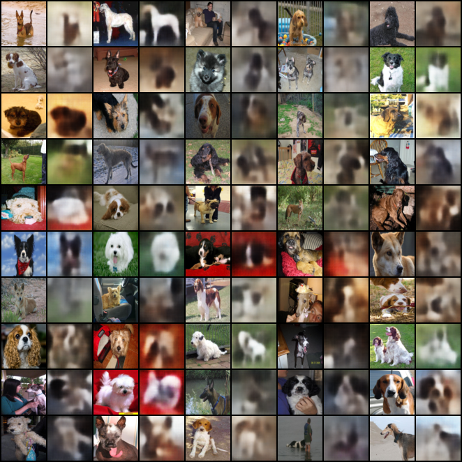
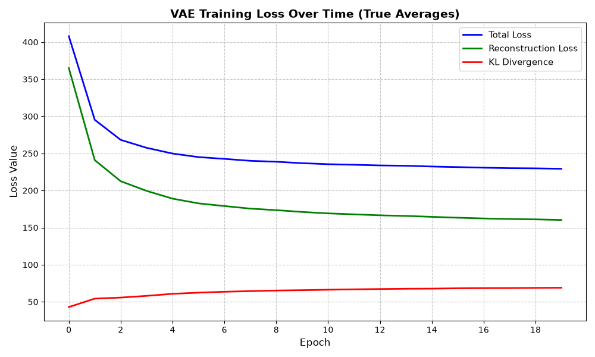

# vae
VAE for Stanford dogs dataset

### Instructions
1. Dependencies: ```pip install -r requirements.txt```

2. Download dataset from HF: ```python download_data.py```

3. Train model and output loss graph: ```python train.py```

4. Output reconstructions for 50 images: ```python reconstruct.py```


### Output

Reconstruction output for 50 random samples:




